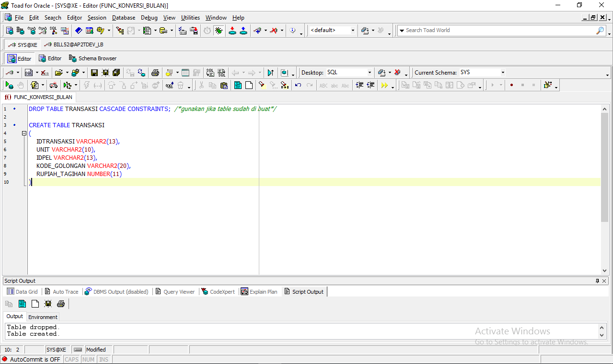
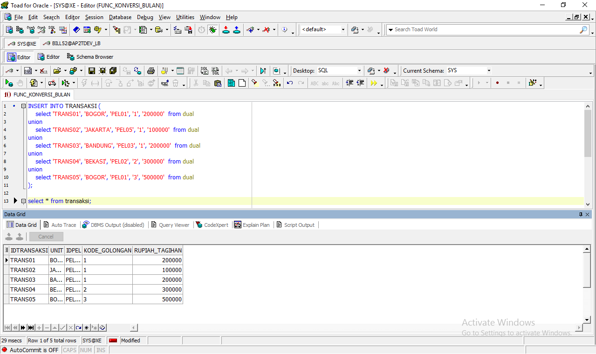
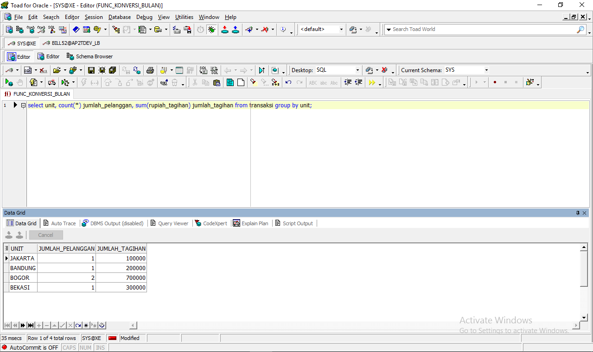
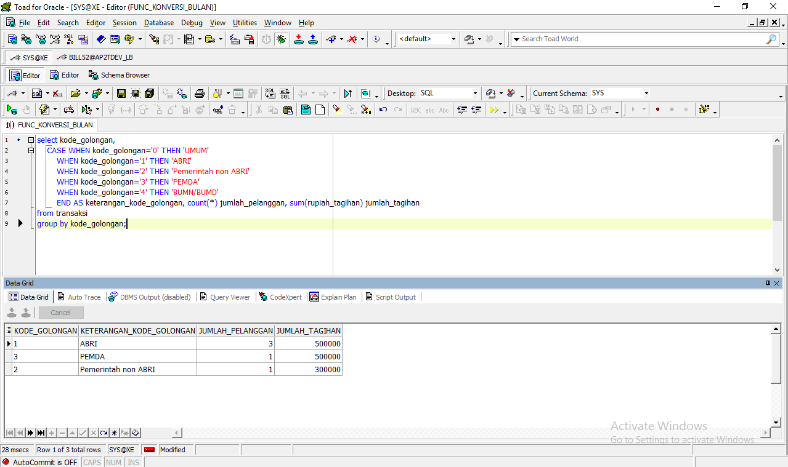
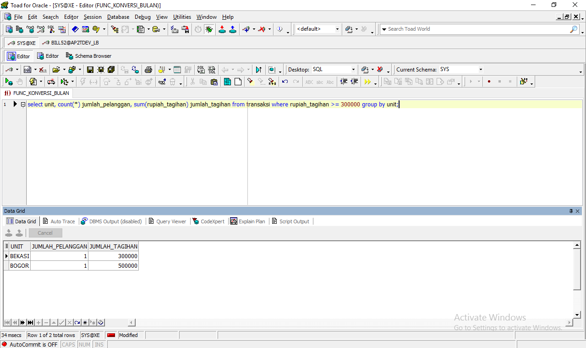
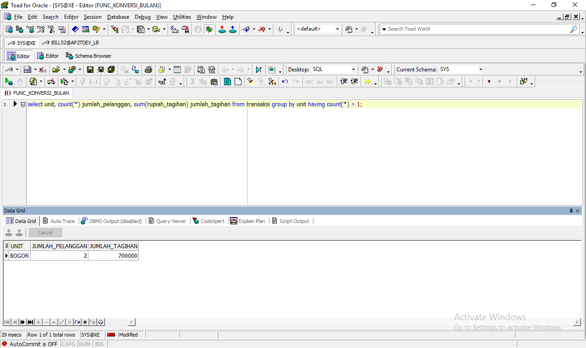

# Belajar PLSQL Sisi 2 - PLSQL #

## Membuat table transaksi ##
```
DROP TABLE TRANSAKSI CASCADE CONSTRAINTS;  /*gunakan jika table sudah di buat*/

CREATE TABLE TRANSAKSI
(
    IDTRANSAKSI VARCHAR2(13),
    UNIT VARCHAR2(10),
    IDPEL VARCHAR2(13),
    KODE_GOLONGAN VARCHAR2(20),
    RUPIAH_TAGIHAN NUMBER(11)
)
```


## Insert data transaksi ##

```
INSERT INTO TRANSAKSI (
select 'TRANS01', 'BOGOR', 'PEL01', '1', '200000'  from dual
union
select 'TRANS02', 'JAKARTA', 'PEL05', '1', '100000'  from dual
union
select 'TRANS03', 'BANDUNG', 'PEL03', '1', '200000'  from dual
union
select 'TRANS04', 'BEKASI', 'PEL02', '2', '300000'  from dual
union
select 'TRANS05', 'BOGOR', 'PEL01', '3', '500000'  from dual
);
```



### Melihat hasil insert data ###
```
select * from transaksi;
```

## Menampilkan tagihan per-cabang, berapakah pelanggan dan tagihannya berapa (unit, jumlah_pelanggan, jumlah_tagihan) ##

```
select unit, count(*) jumlah_pelanggan, sum(rupiah_tagihan) jumlah_tagihan from transaksi group by unit;
```



## Menampilkan tagihan per-kode golongan dan penambahan keterangan kode golongan (kode_golongan, keterangan_kode_golongan, jumlah_pelanggan, jumlah_tagihan) ##

Note penambahan keterangan kode golongan berdasarkan berikut : 
    0   = UMUM
    1   = ABRI
    2   = pemerintah non ABRI
    3   = PEMDA
    4   = BUMN/BUMD ##

```
select kode_golongan,
    CASE WHEN kode_golongan='0' THEN 'UMUM' 
        WHEN kode_golongan='1' THEN 'ABRI' 
        WHEN kode_golongan='2' THEN 'Pemerintah non ABRI' 
        WHEN kode_golongan='3' THEN 'PEMDA'
        WHEN kode_golongan='4' THEN 'BUMN/BUMD'
        END AS keterangan_kode_golongan, count(*) jumlah_pelanggan, sum(rupiah_tagihan) jumlah_tagihan
from transaksi
group by kode_golongan;
```



## Menampilkan tagihan per-unit yang rupiah_tagihan diatas 200000 (unit, jumlah_pelanggan, jumlah_tagihan) ##

```
select unit, count(*) jumlah_pelanggan, sum(rupiah_tagihan) jumlah_tagihan from transaksi where rupiah_tagihan >= 300000 group by unit;
```

## Menampilkan tagihan per-unit yang jumlah pelanggan diatas 1 (unit, jumlah_pelanggan, jumlah_tagihan) ##

```
select unit, count(*) jumlah_pelanggan, sum(rupiah_tagihan) jumlah_tagihan from transaksi group by unit having count(*) > 1;
```
