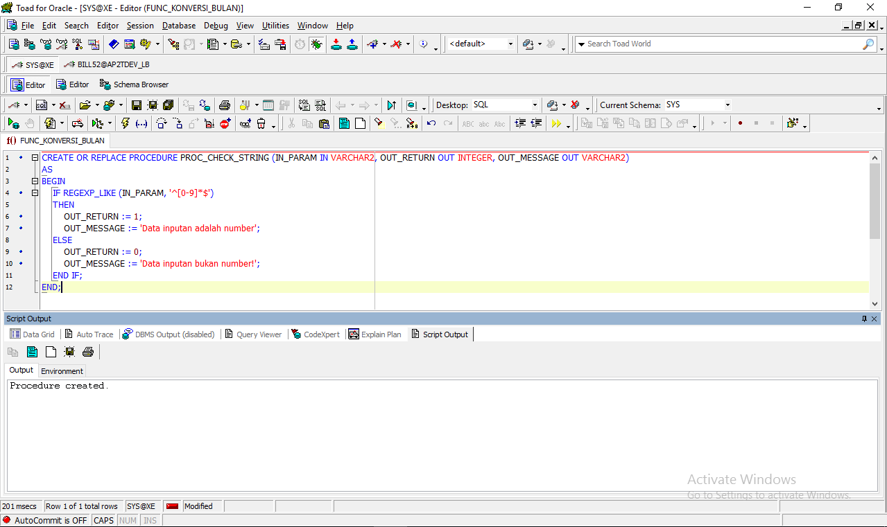
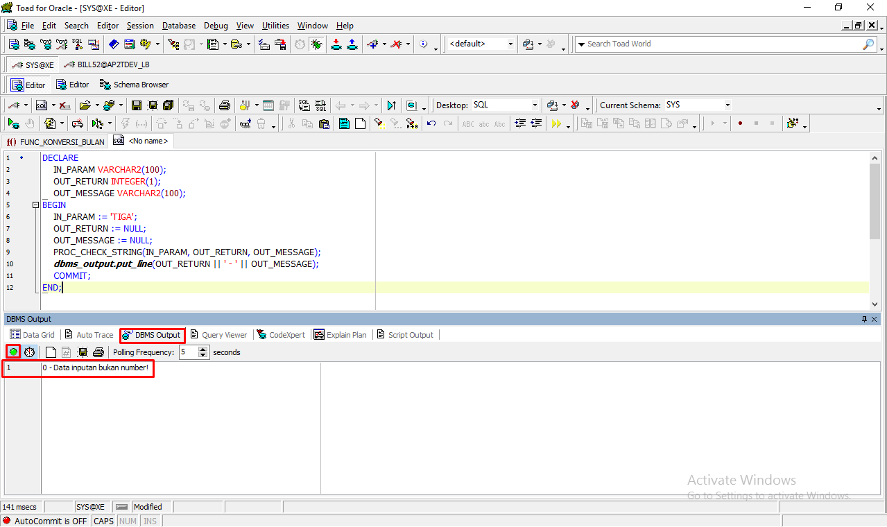
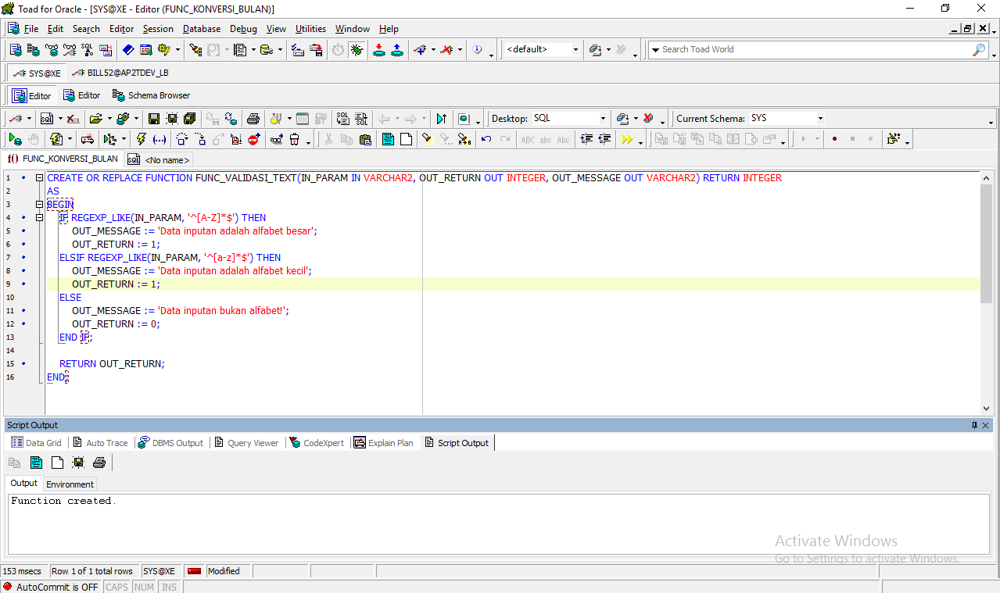
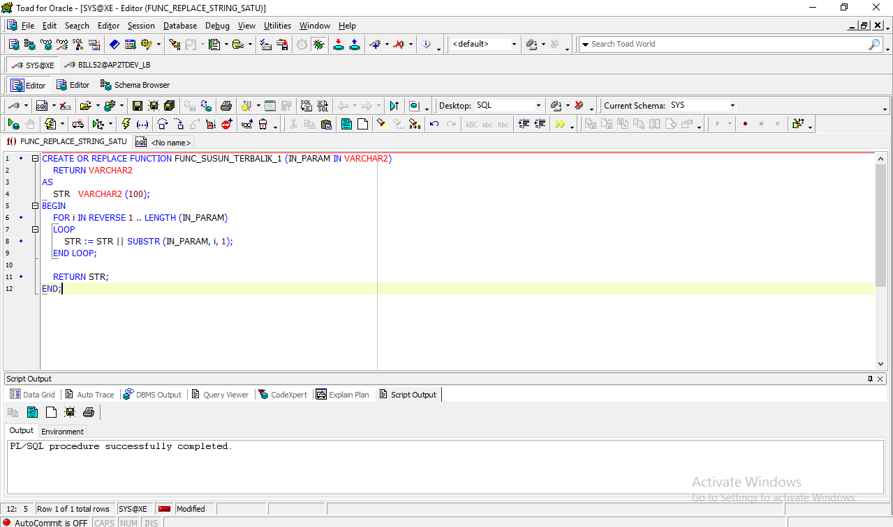
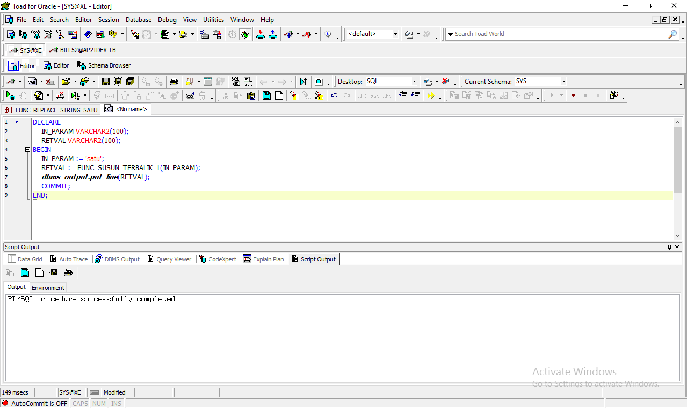
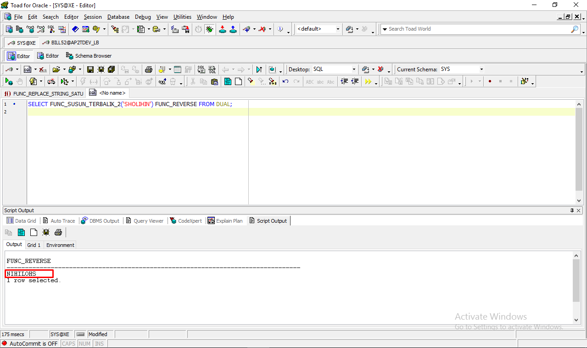
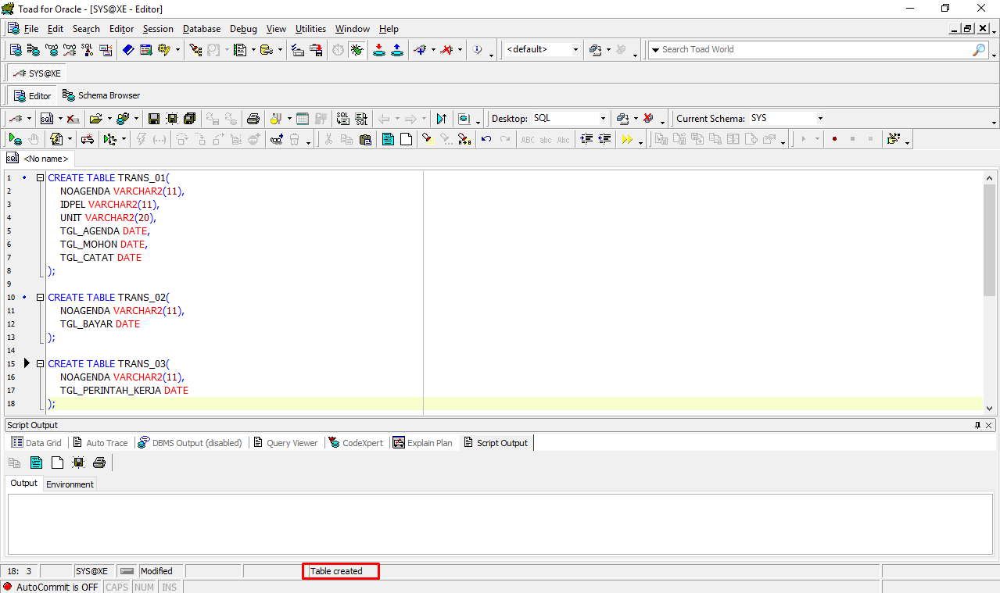

# Belajar PLSQL Sisi 3 - PLSQL #

### Membuat procedure dengan validasi untuk mengecek angka atau bukan, dengan parameter input valuenya, output ada dua buah out yaitu : out_return (integer) dan out_message (varchar2), jika valid return 1 dan jika gagal return 0 dengan keterangan ada di out_message ###
	
```
CREATE OR REPLACE PROCEDURE PROC_CHECK_STRING (IN_PARAM IN VARCHAR2, OUT_RETURN OUT INTEGER, OUT_MESSAGE OUT VARCHAR2)
AS
BEGIN
    IF REGEXP_LIKE (IN_PARAM, '^[0-9]*$')
    THEN
        OUT_RETURN := 1;
        OUT_MESSAGE := 'Data inputan adalah number';
    ELSE
        OUT_RETURN := 0;
        OUT_MESSAGE := 'Data inputan bukan number!';
    END IF;
END;
```


### Cara untuk melihat hasil procedure ###

```
DECLARE
    IN_PARAM VARCHAR2(100);
    OUT_RETURN INTEGER(1);
    OUT_MESSAGE VARCHAR2(100);
BEGIN
    IN_PARAM := 'satu';
    OUT_RETURN := NULL;
    OUT_MESSAGE := NULL;
    SQLTRAIN.PROC_MS_SOAL1(IN_PARAM, OUT_RETURN, OUT_MESSAGE);
    dbms_output.put_line(OUT_RETURN || ' - ' || OUT_MESSAGE);
    COMMIT;
END;
```



### Membuat function validasi untuk mengecek data yang diinput harus huruf alfabet (besar/kecil) dengan return integer dan ada output keterangan jika terjadi gagal ###

```
CREATE OR REPLACE FUNCTION FUNC_VALIDASI_TEXT(IN_PARAM IN VARCHAR2, OUT_RETURN OUT INTEGER, OUT_MESSAGE OUT VARCHAR2) RETURN INTEGER 
AS
BEGIN
    IF REGEXP_LIKE(IN_PARAM, '^[A-Z]*$') THEN
        OUT_MESSAGE := 'Data inputan adalah alfabet besar';
        OUT_RETURN := 1;
    ELSIF REGEXP_LIKE(IN_PARAM, '^[a-z]*$') THEN
        OUT_MESSAGE := 'Data inputan adalah alfabet kecil';
        OUT_RETURN := 1;
    ELSE
        OUT_MESSAGE := 'Data inputan bukan alfabet!';
        OUT_RETURN := 0;
    END IF;
    
    RETURN OUT_RETURN;
END;
```


### Cara untuk menguji function ###

```
DECLARE
    RETVAL INT;
    IN_PARAM VARCHAR2(100);
    OUT_RETURN NUMBER;
    OUT_MESSAGE VARCHAR2(100);
BEGIN
    IN_PARAM := 'a';
    OUT_MESSAGE := NULL;
    RETVAL := FUNC_VALIDASI_TEXT(IN_PARAM, OUT_RETURN, OUT_MESSAGE);
    dbms_output.put_line(RETVAL || ' - ' || OUT_MESSAGE);
    COMMIT;
END;
```


### Bikin function reverse text/membalik text misal jika input ABC akan menghasilkan text CBA ###

### CARA 1 ###
```
CREATE OR REPLACE FUNCTION FUNC_SUSUN_TERBALIK_1 (IN_PARAM IN VARCHAR2)
    RETURN VARCHAR2
AS
    STR   VARCHAR2 (100);
BEGIN
    FOR i IN REVERSE 1 .. LENGTH (IN_PARAM)
    LOOP
        STR := STR || SUBSTR (IN_PARAM, i, 1);
    END LOOP;

    RETURN STR;
END;
```


## Menguji function yang di buat - Cara 1 ##

```
DECLARE
    IN_PARAM VARCHAR2(100);
    RETVAL VARCHAR2(100);
BEGIN
    IN_PARAM := 'satu';
    RETVAL := FUNC_SUSUN_TERBALIK_1(IN_PARAM);
    dbms_output.put_line(RETVAL);
    COMMIT;
END;
```


### CARA 2 ###

```
CREATE OR REPLACE FUNCTION FUNC_SUSUN_TERBALIK_2 (IN_PARAM IN VARCHAR2)
   RETURN VARCHAR2
AS
   RESULT   VARCHAR2 (100);
BEGIN
   SELECT REVERSE (TO_CHAR (IN_PARAM)) INTO RESULT FROM DUAL;

   RETURN RESULT;
END;
```

## Cara melihat function yang di buat - Cara 2 ##

```
SELECT FUNC_SUSUN_TERBALIK_2('SHOLIHIN') FUNC_REVERSE FROM DUAL;
```


### Membuat view untuk menampilan data yang sudah dicetak dengan column yang di tampilkan adalah trans_01.tgl_mohon, trans_03.tgl_cetak) tapi status transaksinya belum dibayar yaitu pada tabel trans_02.tgl_bayar) yang yg tgl_lunas transaksi bulan ini (noagenda, tglmohon (tglcatat trans_01), tglbayar(tgl_02), tglpk) ###


```
/*TRANS_01*/
CREATE TABLE TRANS_01(
    NOAGENDA VARCHAR2(30),
    UNIT VARCHAR2(20),
    IDPEL VARCHAR2(11),
    KODE_GOLONGAN VARCHAR2(20),
    RUPIAH_TAGIHAN NUMBER(11),
    TGL_AGENDA DATE,
    TGL_MOHON DATE,
    TGL_CATAT DATE,
    CONSTRAINT trans1_noagenda_pk PRIMARY KEY (NOAGENDA)
);

/*TRANS_02*/
CREATE TABLE TRANS_02(
    NOAGENDA VARCHAR2(30),
    TGL_BAYAR DATE,
    CONSTRAINT trans2_noagenda_pk PRIMARY KEY (NOAGENDA)
);

/*TRANS_03*/
CREATE TABLE TRANS_03(
    NO_PK VARCHAR2(30),
    NOAGENDA VARCHAR2(30),
    TGL_PERINTAH_KERJA DATE,
    CONSTRAINT nopk_pk PRIMARY KEY (NO_PK)
);
```

```
/*TRANS_01*/
INSERT INTO TRANS_01 (
    select 'AGN01', 'BOGOR', 'PEL01', '1', '200000', to_date('2022-09-11', 'yyyy-mm-dd'), to_date('2022-09-02', 'yyyy-mm-dd'), to_date('2022-09-29', 'yyyy-mm-dd')  from dual
    union
    select 'AGN02', 'JAKARTA', 'PEL05', '1', '100000', to_date('2022-09-13', 'yyyy-mm-dd'), to_date('2022-09-02', 'yyyy-mm-dd'), to_date('2022-09-29', 'yyyy-mm-dd')  from dual
    union
    select 'AGN03', 'BANDUNG', 'PEL03', '1', '200000', to_date('2022-09-15', 'yyyy-mm-dd'), to_date('2022-09-08', 'yyyy-mm-dd'), to_date('2022-09-30', 'yyyy-mm-dd')  from dual
    union
    select 'AGN04', 'BEKASI', 'PEL02', '2', '300000', to_date('2022-09-10', 'yyyy-mm-dd'), to_date('2022-09-05', 'yyyy-mm-dd'), to_date('2022-09-30', 'yyyy-mm-dd')  from dual
    union
    select 'AGN05', 'BOGOR', 'PEL01', '3', '500000', to_date('2022-09-15', 'yyyy-mm-dd'), to_date('2022-09-09', 'yyyy-mm-dd'), to_date('2022-09-28', 'yyyy-mm-dd')  from dual
);

/*TRANS_02*/
INSERT INTO TRANS_02 (
    select 'AGN01', to_date('2022-09-12', 'yyyy-mm-dd') from dual
    union
    select 'AGN03', to_date('2022-09-13', 'yyyy-mm-dd') from dual
    union
    select 'AGN04', to_date('2022-09-14', 'yyyy-mm-dd') from dual
    union
    select 'AGN05', to_date('2022-09-13', 'yyyy-mm-dd') from dual
    union
    select 'AGN02', to_date('2022-09-11', 'yyyy-mm-dd') from dual
);

/*TRANS_03*/
INSERT INTO TRANS_03 (
    select 'PK01', 'AGN01', to_date('2022-09-12', 'yyyy-mm-dd') from dual
    union
    select 'PK02', 'AGN03', to_date('2022-09-13', 'yyyy-mm-dd') from dual
    union
    select 'PK03', 'AGN04', to_date('2022-09-14', 'yyyy-mm-dd') from dual
    union
    select 'PK04', 'AGN05', to_date('2022-09-13', 'yyyy-mm-dd') from dual
    union
    select 'PK05', 'AGN02', to_date('2022-09-11', 'yyyy-mm-dd') from dual
);
```



### Create New Table ###

```
CREATE TABLE TRANS_01(
    NOAGENDA VARCHAR2(11),
    IDPEL VARCHAR2(11),
    UNIT VARCHAR2(20),
    TGL_AGENDA DATE,
    TGL_MOHON DATE,
    TGL_CATAT DATE
);

CREATE TABLE TRANS_02(
    NOAGENDA VARCHAR2(11),
    TGL_BAYAR DATE
);

CREATE TABLE TRANS_03(
    NOAGENDA VARCHAR2(11),
    TGL_PERINTAH_KERJA DATE
);
```

```
CREATE OR REPLACE VIEW VW_RELASI_TRANSAKSI
AS
    SELECT A.NOAGENDA,
           A.TGL_CATAT,
           A.TGL_MOHON,
           B.TGL_BAYAR,
           C.TGL_PERINTAH_KERJA
      FROM TRANS_01 A, TRANS_02 B, TRANS_03 C
        WHERE B.TGL_BAYAR BETWEEN TO_DATE ('09/11/2022', 'mm/dd/yyyy') AND TO_DATE ('09/12/2022', 'mm/dd/yyyy')
           AND C.TGL_PERINTAH_KERJA IS NOT NULL
           AND B.TGL_BAYAR IS NOT NULL
           AND A.NOAGENDA = B.NOAGENDA
           AND C.NOAGENDA = B.NOAGENDA;
```

Cara melihat hasil view:

```
SELECT * FROM VW_RELASI_TRANSAKSI;
```

1. Bikin view untuk menampilkan data pada tabel trans_01.idpel, trans_02.tgl_bayar, trans_03.tgl_perintah_kerja di gabung berdasarkan unit, dengan menghitung jumlah yang sudah bayar, jumlah pelanggan dan jumlah yang sudah cetak untuk transaksi bulan ini.

```
CREATE VIEW vw_grouping_and_count AS
    SELECT
        COUNT(b.tgl_bayar)          jumlah_sudah_bayar,
        COUNT(a.idpel)              jumlah_pelanggan,
        COUNT(c.tgl_perintah_kerja) jumlah_cetak_pk
    FROM
        trans_01 a,
        trans_02 b,
        trans_03 c
    WHERE
        a.tgl_agenda BETWEEN TO_DATE('09/01/2022', 'mm/dd/yyyy') AND TO_DATE('09/30/2022', 'mm/dd/yyyy')
        AND b.noagenda = a.noagenda
        AND c.noagenda = a.noagenda
    GROUP BY
        a.unit;
```

### Cara melihat hasil view ###

```
SELECT * FROM vw_grouping_and_count;
```