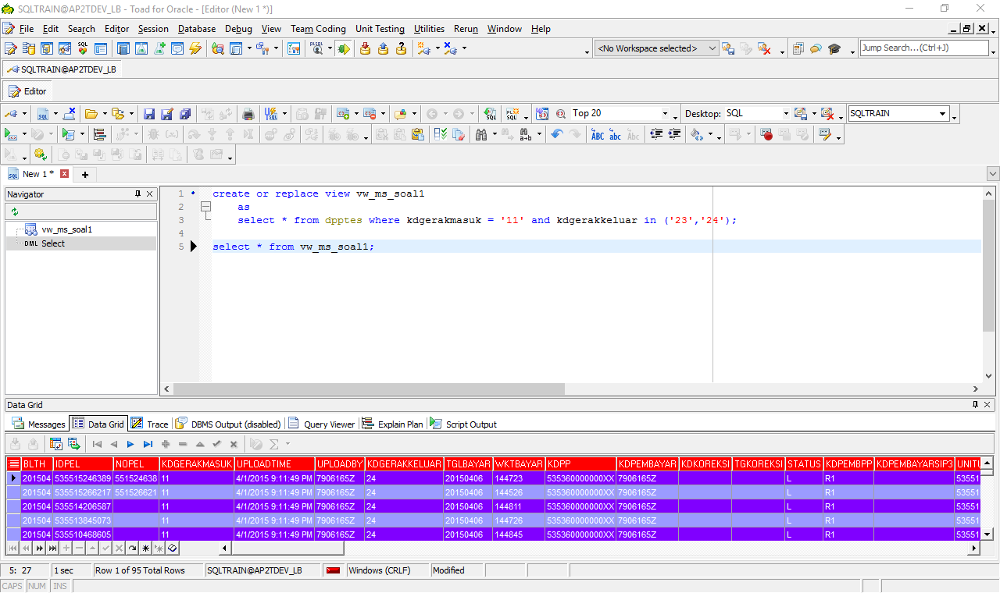
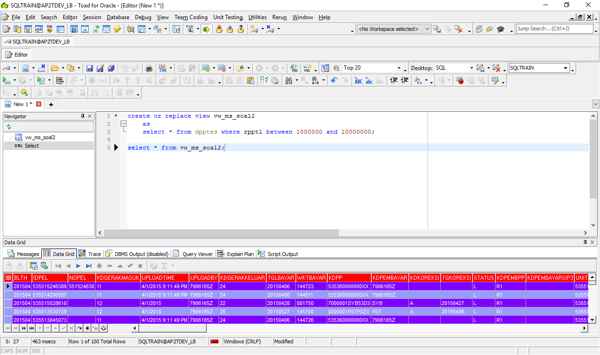
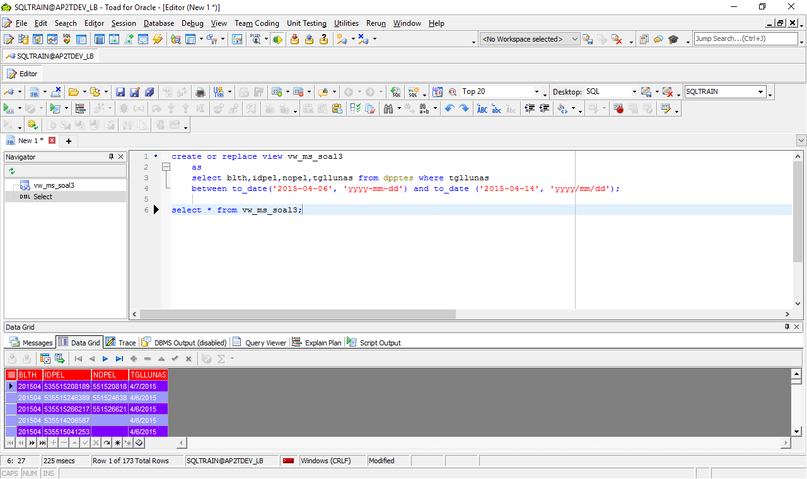
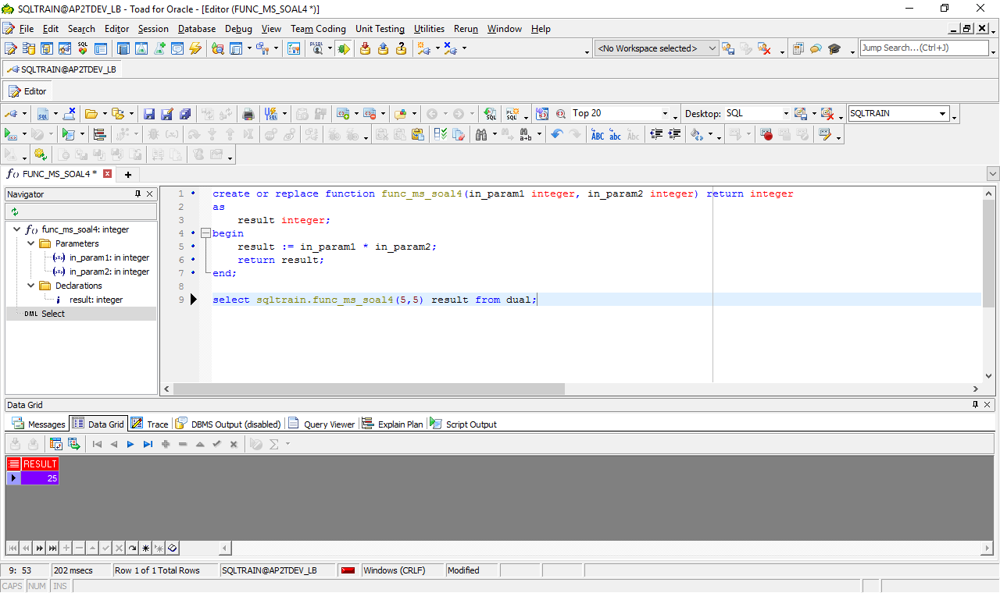
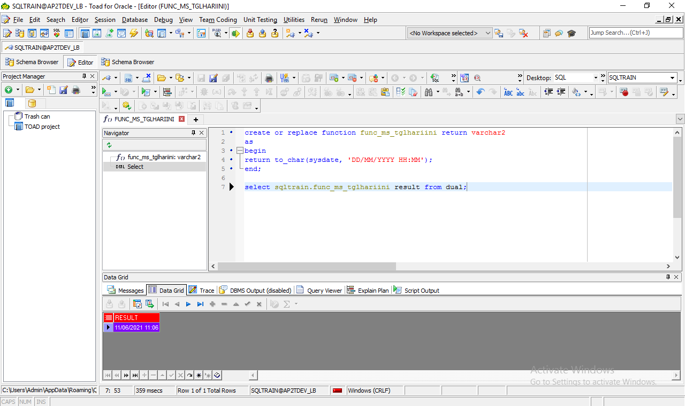
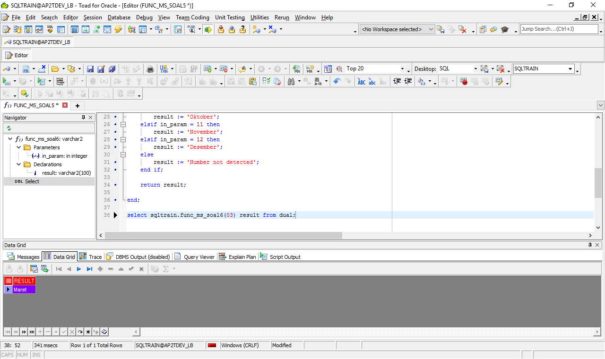

# PR Sisi 1 - PLSQL#

## Tugas 1 ##
### Membuat tabel view dari dpptes yang kdgerakmasuk 11 dan kdgerakkeluar 23 atau 24 ###
```
create or replace view vw_ms_soal1
    as 
    select * from dpptes where kdgerakmasuk = '11' and kdgerakkeluar in ('23','24');
```

### Melihat hasil fungsi ###
```
select * from vw_ms_soal1
```




## Tugas 2 ##
###  Membuat tabel view dari dpptes yang rpptl diantara 1 juta sampai 10 juta ###
```
create or replace view vw_ms_soal2
    as 
    select * from dpptes where rpptl between 1000000 and 10000000;
```

### Melihat hasil fungsi ###
```
select * from vw_ms_soal2
```



## Tugas 3 ##
### Membuat tabel view dari tabel dpptes yang tgllunas dari tanggal 2015-04-06 sampai 2015-04-14 ###
```
create or replace view vw_ms_soal3
    as 
    select blth,idpel,nopel,tgllunas from dpptes where tgllunas 
    between to_date('2015-04-06', 'yyyy-mm-dd') and to_date ('2015-04-14', 'yyyy/mm/dd');
```

### Melihat hasil fungsi ###
```
select * from vw_ms_soal3
```



## Tugas 4 ##
### Membuat function perkalian ###
```
create or replace function func_ms_soal4(in_param1 integer, in_param2 integer) return integer
as
    result integer;
begin
    result := in_param1 * in_param2;
    return result;
end;
```

### Melihat hasil fungsi ###
```
select sqltrain.func_ms_soal4(5,5) result from dual;
```



## Tugas 5 ##
### Membuat function tanggal hari ini ###
```
create or replace function func_ms_soal5 return varchar2
as
begin
    return to_char(sysdate, 'DD/MM/YYYY HH24:MI');
end;
```

### Melihat hasil fungsi ###
```
select sqltrain.func_ms_soal5 result from dual;
```



## Tugas 6 ##
### Membuat function konversi dari dua digit bulan ke nama bulan ###
```
create or replace function func_ms_soal6(in_param integer) return varchar2
as
result varchar2(100);
begin

    if in_param = 1 then
        result := 'Januari';
    elsif in_param = 2 then
        result := 'Februari';
    elsif in_param = 3 then
        result := 'Maret';
    elsif in_param = 4 then
        result := 'April';
    elsif in_param = 5 then
        result := 'Mei';
    elsif in_param = 6 then
        result := 'Juni';
    elsif in_param = 7 then
        result := 'Juli';
    elsif in_param = 8 then
        result := 'Agustus';
    elsif in_param = 9 then
        result := 'September';
    elsif in_param = 10 then
        result := 'Oktober';
    elsif in_param = 11 then
        result := 'November';
    elsif in_param = 12 then
        result := 'Desember';
    else
        result := 'Number not detected';
    end if;

    return result;

end;
```

### Melihat hasil fungsi ###
```
select sqltrain.func_ms_soal6(03) result from dual;
```

