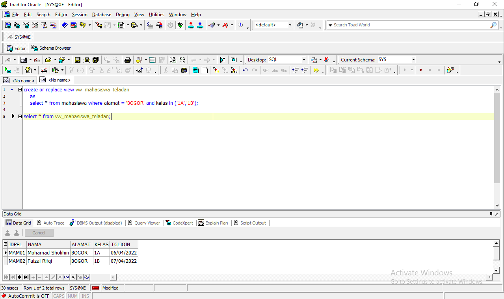

# Tahap Instalasi Oracle XE #

### Link Oracle XE Win64 ###
```
https://drive.google.com/file/d/1Ul-gh7nqChDsiGEzqjkE1mZ-3R1sTBlW/view?usp=sharing

```

### Install Oracle XE ###



### Membuat Schema / User Baru ###
```
CREATE USER SHOLIHIN IDENTIFIED BY sholihin;
```

### Memberi Akses Pada User Baru ###
```
GRANT CREATE TABLE TO sholihin;
```

### Melihat User Yang Sudah Dibuat ###
```
SELECT username, account_status FROM dba_users WHERE username = 'SHOLIHIN';
```

### Mengubah Password User Jika Dibutuhkan ###
```
ALTER USER SHOLIHIN IDENTIFIED BY sholihin;
```